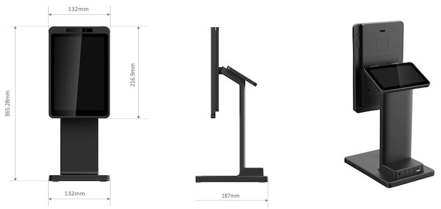
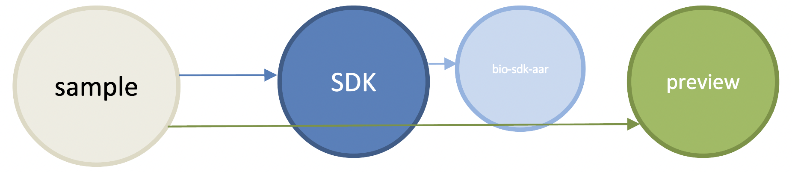
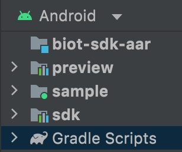
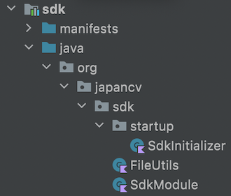
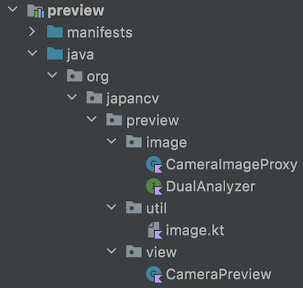

# PayPadPlus-Android-Sample-App

[](https://github.com/japancv/PayPadPlus-Android-Sample-App/blob/main/LICENSE)

This is the demonstration of how to develop Android application with Face Detection SDK on PayPadPlus.

## Prerequisite

- [PayPadPlus]() device
- Install [Android Studio](https://developer.android.com/studio)
- Connect PayPadPlus device and your computer. More [detail](document/adb.md)
- Download the Face detection SDK, [here](https://docs.japancv.co.jp/jcv-liveness-sdk/)
- Apply JCV Anysee account, [here](https://docs.cloud.japancv.co.jp/docs/anysee-quick-start)

## Demonstration

This app is demonstrating:
1. How to develop App on PayPadPlus.
2. How to use JCV Face Detection SDK on PayPadPlus.
3. How to integrate with JCV Anysee server-side 1:N Face Recognition.

#### PayPadPlus



#### JCV Anysee

Once you apply JCV Anysee, in order to run this sample app, please update the following credential and information in `AnyseeFaceRecognitionApi.kt` file. 

```kotlin
private const val FACE_MODEL = ""
private const val CLASS = ""
private const val TTL = 3_600L
private const val MAX_ENTITY_NUM = 10
private const val THRESHOLD = 0.9
private const val COLLECTION = ""
private const val KEY = ""
private const val BASE_URL = ""
private const val INSTANCE_ID = ""
private const val API_KEY = ""
```

## Structure of this app

In this app, we use Gradle build system separate into 1 app module and 3 lib modules. 





### modules:

#### sample
The main application module presents the scenario of taking a photo and recognize the face.

      


#### bio-sdk-aar

SDK artifact wrapper module, it purely includes SDK artifact (.aar) file.

#### sdk

In this module, it has the dependency with [bio-sdk-aar](#bio-sdk-aar) and having helpers in the regard of initialize and using the SDK.



#### preview

This module provides the utilities in order to control the cameras, capturing the frames from cameras, and display the camera preview.



## App Permissions

```xml
<uses-permission android:name="android.permission.INTERNET" />
<uses-permission android:name="android.permission.CAMERA"/>
```

## How to run

1. Clone this repository and import into **Android Studio**

```
git clone git@github.com:japancv/paypadplus-android-sample.git
```

2. Download Face detection SDK. 
   2.a. Rename the SDK AAR file (in `libs` folder of SDK package) to `sdk.aar` and place it into [biot-sdk-aar](biot-sdk-aar)`/lib`.
   2.b. Copy the `LICENSE.lic`, `config` and `model`, paste and replace in [sdk/src/main/assets](sdk/src/main/assets).

 
3. Fill up the JCV Anysee credential and information in the file, [AnyseeFaceRecognitionApi.kt](sample/src/main/java/org/japancv/sample/data/fr/AnyseeFaceRecognitionApi.kt)

```kotlin
private const val FACE_MODEL = ""
private const val CLASS = ""
private const val TTL = 3_600L
private const val MAX_ENTITY_NUM = 10
private const val THRESHOLD = 0.9
private const val COLLECTION = ""
private const val KEY = ""
private const val BASE_URL = ""
private const val INSTANCE_ID = ""
private const val API_KEY = ""
```

4. In Android Studio, you can generate the apk or execute `Run 'sample'`

## Device Skin for emulator

If you would like to apply the device skin on the Android Virtual Device, see [this](document/skin.md) for the details.


## Troubleshooting

- *When open this Sample app project from Android Studio and happen error relates NDK*

In `local.properties` file, add NDK directory path. For example: `ndk.dir=/Android/sdk/ndk/25.1.8937393`

## References

- [JCV Anysee API reference](https://docs.cloud.japancv.co.jp/reference)
- [JCV Cloud](https://www.japancv.co.jp/en/solutions/fr_cloud/)
- [JCV solutions](https://www.japancv.co.jp/en/solutions/)
- [PayPadPlus](https://www.japancv.co.jp/en/solutions/fr_payment/)

## License

[MIT](LICENSE)