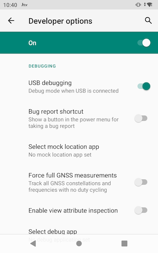
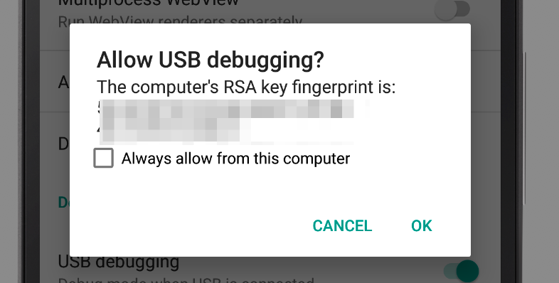

## Android Debug Bridge (ADB) Connect to Device over USB

### What is Android Debug Bridge (ADB)?

Android Debug Bridge ([ADB](https://developer.android.com/studio/command-line/adb)) is a command-line tool that allows you to communicate with an Android device. It is used to bridge communication between an emulator instance (Android device) and the background running daemon process (server). It helps you perform different actions like installing or debugging a device and run various commands on a device by providing access to a Unix shell.
Using any real device for mobile automation testing has always been a challenge for testers. But, Android offers a handful of solutions to connect a real device over USB (Universal Serial Bus), i.e., Android Debug Bridge (ADB).

### How to Connect Android Device with ADB (Android Debug Bridge)

#### Step 1: Enable USB Debugging on your device

Enable USB debugging option from [Developer Option](https://developer.android.com/studio/debug/dev-options) in Android phone. Now, connect your Android device to the computer using USB cable.


#### Step 2: Connect your device via USB

Once connect your device via USB to your host machine, on the device it should prompt a dialog for the authorization.


#### Step 3: Check if it is connected

Use `adb` command-line tool to check if your device has been connected. 

```shell
$ adb devices
```

For `adb` detail and how to install adb, please follow this [instructions](https://developer.android.com/studio/command-line/adb)