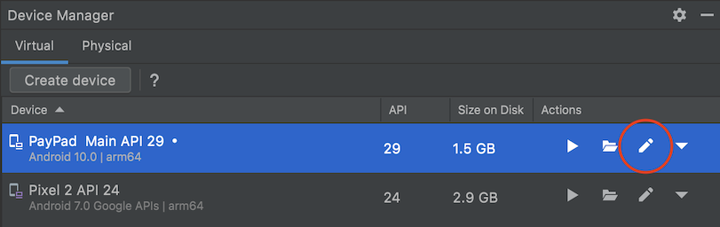
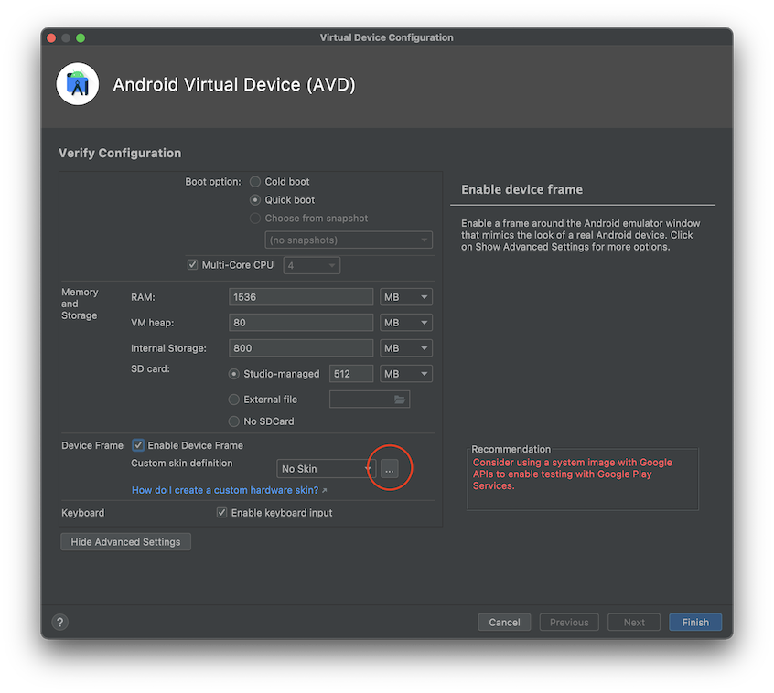
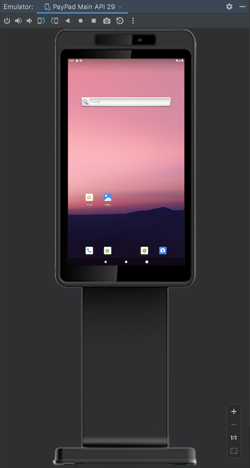

## Android Emulator Skin

An emulator skin specifies the appearance of a device. The Device Manager provides some predefined skins. You can also define your own, or use skins provided by third parties.

### How to apply PayPadPlus device skin

1. In Device Manager, edit an AVD you would like to apply for the skin



2. In the AVD configuration window, in `Device Frame`, select `Enable Device Frame` and click the `...` button to choose the skin folder.



3. Select [PayPadPlus](../skin/PayPadPlus) folder and click `Finish`.
4. Run the AVD, it should show the emulator with the device skin. 




### Appendix - PayPadPlus hardware profile

```ini
hw.ramSize=2048
hw.cpu.ncore=2
hw.initialOrientation=portrait
hw.screen=touch
hw.lcd.density=320
hw.keyboard=yes
hw.mainKeys=no
hw.cpu.arch=arm64
hw.lcd.height=800
hw.lcd.width=1280
hw.touchScreen=yes
hw.sensors.orientation=no
hw.trackBall=no
skin.name=PayPadPlus
skin.dynamic=no
skin.name=800x1280
showDeviceFrame=yes
```